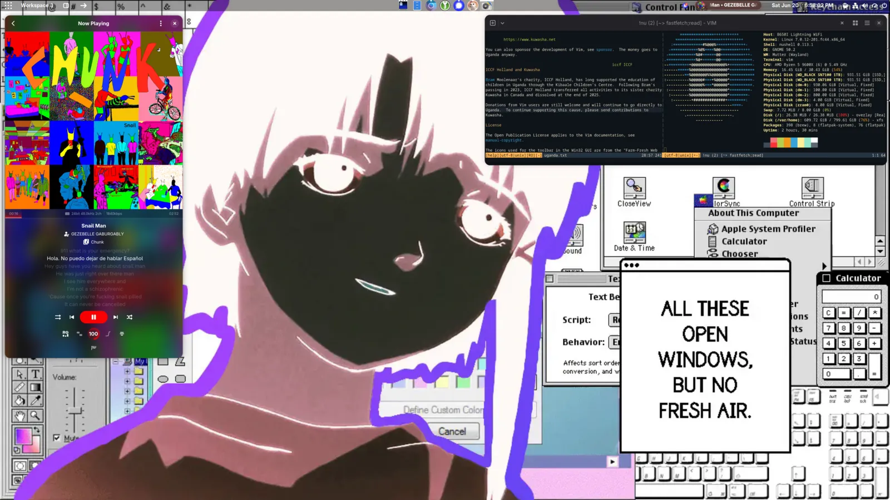

# .dotfiles

i used to keep my dotfiles in a private git repo on a local git forge, but i sanitized them now. some of this stuff might be as old as 2021.

right now my main setup looks like:

- [secureblue](https://secureblue.dev)
- [Gnome](https://www.gnome.org/) 50
- [PaperWM](https://github.com/paperwm/PaperWM)
- [Dash to Panel](https://github.com/home-sweet-gnome/dash-to-panel)
- [Trivalent](https://github.com/secureblue/Trivalent) with Vimium & vertical tabs
- [Vim](https://www.vim.org/) 9.2
- [nushell](https://www.nushell.sh/) 113
- [Ghostty](https://ghostty.org/)

